# 在线学习 #
## 2018.09.25 王珏 ##
## 场景 ##

在线学习框架，每一次迭代，环境给出一个样本，模型作出预测并产生loss，更新样本  
广告场景：用户请求->模型预估->产生loss(用户是否点击)->更新模型  
业务实践：用户请求->模型预估->等待一天(或小时级)->产生loss(用户是否点击)->更新模型  
  

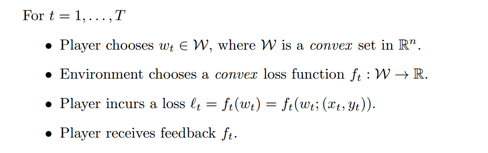

## 在线学习算法评估 ##

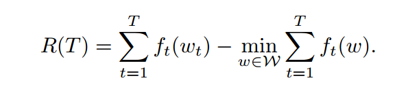
解释：评估后悔程度，w为全局最优解，w_t为每次更新的权重，R(T)表示了在线学习和批量学习的gap。当R(T)随T增长低于线性时，效果随迭代而增加.  
分析方法： 对于在线学习算法，证明其R(T)<=a，得到效果下界。  

举例：  
最简单的在线学习算法，在线梯度下降，R(T)分析略。  

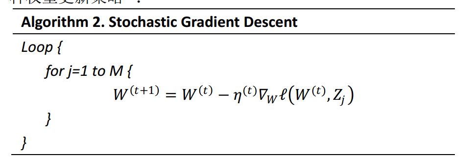

## 关于稀疏性 ##

一般是通过约束区域和损失函数等高线，证明l1比l2更容易获得稀疏解。  
另外一种解释： l2在靠近0的附近变化变小，而l1变化量不变。  

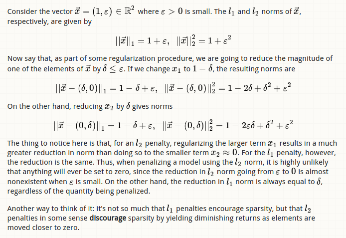

优化问题没有解析解时，即使使用l1也很难获得稀疏解。l1只能保证快速逼近到0附近。在线学习只使用l1不容易获得稀疏解。需要额外手段来保证稀疏。  

## 在线梯度下降l1正则化 ##

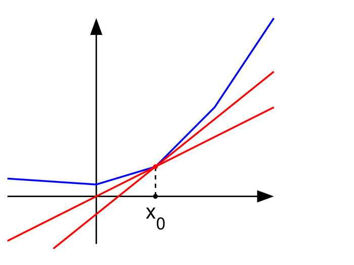

## 次梯度 ##

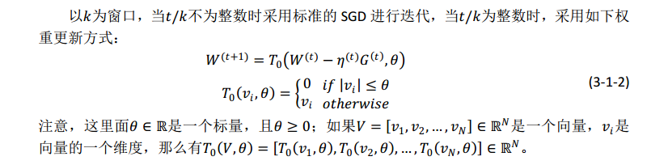

## 简单截断法 ##

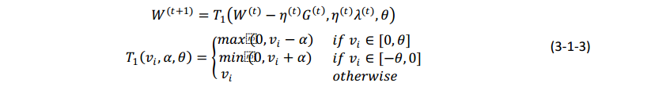

直观的获得稀疏性的方法，当权重小于阈值时设置为0  

## 截断梯度法 ##

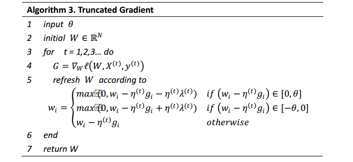

## l1正则化和简单截断法都是梯度截断的特殊形式。 ##

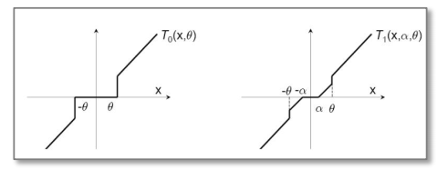
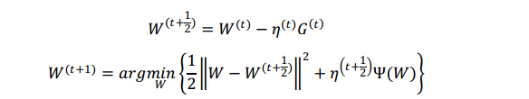

## FOBOS ##

权重更新分两个步骤：  

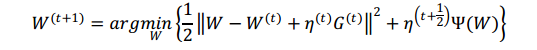

第一步为梯度下降，第二步在第一步梯度下降得到权重附近加入正则进行最优化。  
合并公式有：  

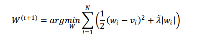

考虑正则为l1的FOBOS：  

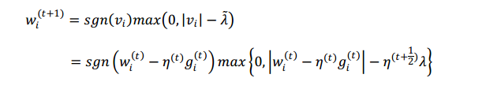

使用技巧求解，得到  

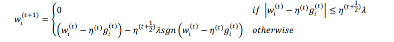

写成梯度截断的形式：  

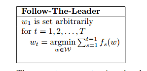

显式的获取稀疏性。  

## FTL ##

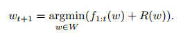

在线学习中每一轮将w更新为在全部历史轮数上的最有解。  

## FTRL ##

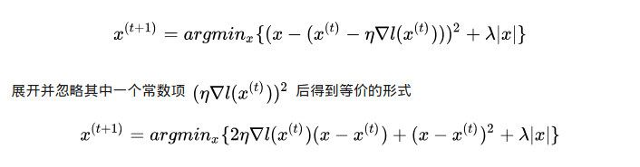

## FTRL-Proximal ##
考虑l1-FOBOS的更新公式：  

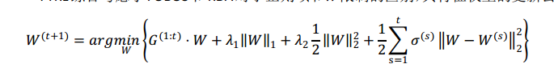

定义FTRL损失函数f_(t+1)(x) = g_t(x-x_t) + (1/n_t-1/n_(t-1))(x-x_t)^2  
套用FTRL优化方法：argmin sigma{f_t}+R 得到FTRL的优化函数  

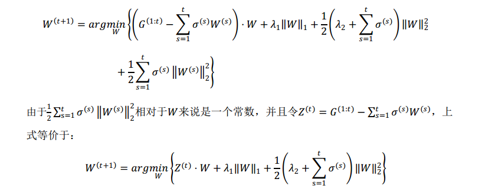

将最后一项展开，可以得到  

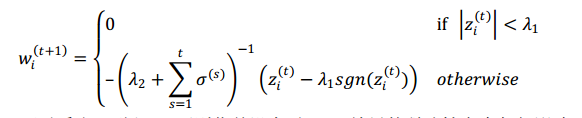

